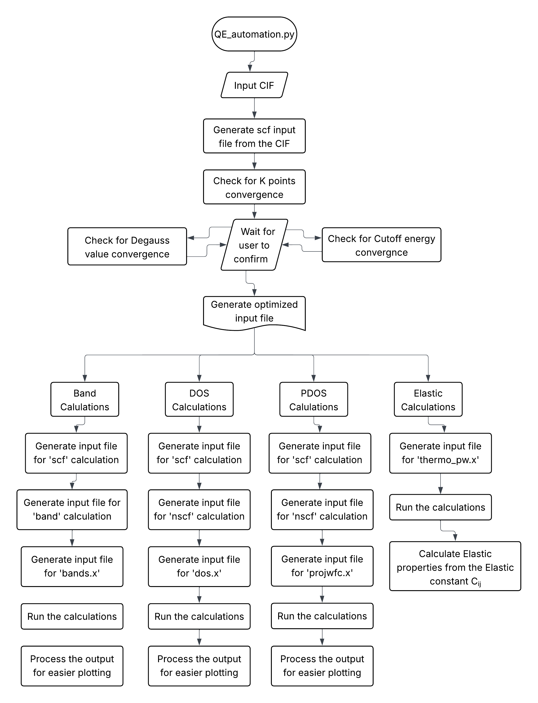

Structural and Electronic Properties Analysis by Quantum Espresso
Automation using Python

# Introduction:

Quantum Espresso is an open-source set of algorithms commonly used for
electronic-structure calculations and materials modeling at the
nanoscale. Based on density functional theory (DFT), plane-wave basis
sets, and pseudopotentials, Quantum Espresso (QE) enables simulations of
a wide range of properties---such as total energy, structural
optimization, electronic band structure, phonon dispersion, and more. It
supports both ground-state and excited-state calculations. QE is popular
in both academic and industrial research for its flexibility, broad
community support, and abilities to simulate complicated materials with
high accuracy. Though QE gives more customisation and scales well with
high-performance simulations, it command line interface makes it less
appealing from its graphical counter parts like Material Studio or VASP.
To make it easier to use I have developed a Python program that takes
minimum user input but yet delivers the customizability and versatility
of Quantum Espresso. This application handles the input files creation
for several calculations: 1. Geometry optimization, 2. Band structure
Calculation, 3. Density of States (DOS) calculation, 4.Partial DOS
calculation & 5. Elastic Properties computation. This software also
handles conducting the calculation and output processing. The input
files are constructed from a user specified CIF (Crystallographic
Information File) file and the elastic properties calculations are done
using a version of QE called 'Thermo_pw' which leverages QE as its main
engine. The program also allows the calculation for SOC (spin orbit
coupling) effect on band, dos and pdos.

Prerequisites:

-   Quantum espresso must be installed in system.
-   Install 'thermo_pw' extension if you want to do Elastic calculation.
-   Python3, numpy and matplotlib is also required

Usages:

Get the program from Github .Copy all four python file to the working
folder. In this folder copy the CIF file and the pseudopotential file
you want to do calculation with (if you want to check SOC effect use
full relativistic pseduopotential). Open the QE_automation.py . Go to
the end of the file. Where you can select which calculation to run. The
available calculations are.

  ------------- ----------
  Without SOC   With SOC
                
                
                
                
  ------------- ----------

And 9. elastic_run()

You can run all the calculation at once by running the python program in
the terminal by the command 'python3 QE_automation.py". If you want to
run a specific calculation, you can comment out any of these line by
adding '#' at the start of the line. This will skip that calculation. Or
you can run one specific run by commenting out the others. But before
any without SOC calculation or elastic_run(), get_tuned_scf() must be
run at least once to generated the geometry optimized file which is
requied for (3), (5), (7) (9). Same applied for with SOC calculation.
The soc.get_tuned_scf() must be run at least once to generate the
geometry optimized file which is required for (4), (6), (8).

Workflow:

1\. Generating QE input file from CIF:

-   Uses cell parameters and angles to classify the lattice (cubic,
    tetragonal, etc.).

-   Based on the lattice and space group, determines the QE ibrav number
    (lattice type identifier).

-   For each atom, applies all symmetry operations found in the CIF.

-   Each unique position is added, duplicates are filtered out using a
    tolerance of 0.0001.

-   Determination for k-points grid used in Brillouin zone sampling was
    done by an approximation of Monkhorst-Pack grid, which is

    $${K_{\mathit{px}} = \frac{1}{a \ast \mathit{seperation}}},{K_{\mathit{py}} = \frac{1}{b \ast \mathit{seperation}}},{K_{\mathit{pz}} = \frac{1}{c \ast \mathit{seperation}}}\cdots\cdots\cdots\cdots\cdots\cdots\cdots\cdots\cdots{(1)}$$$$$$

-   Then Composes the Quantum ESPRESSO input which contains the
    following section:

    -   &CONTROL: sets general run options like calculation type, file
        locations, and ouput control.
    -   &SYSTEM: descrips the physical system like lattice, atom types,
        cutoffs, and electronic structure settings.
    -   &ELECTRONS: configures how the electronic self-consistent field
        is solved, including convergence and mixing parameter.
    -   ATOMIC_SPECIES: list each atomic species presnt, their atomic
        mass, and the corresponding pseudopotential file.
    -   ATOMIC_POSITIONS: Specifies the positions of all the atoms in
        the unit cell in fractional (crystal) coordinates.
    -   K_POINTS: defines the sampling of the Brillouin zone, use an
        approximation of Monkhorst-Pack grid.

{width="6.6929in"
height="8.7299in"}

2\. Optimization of input file:

Choosing ideal settings for k-points, ecutwfc, and degauss is crucial to
ensure that Quantum ESPRESSO calculations are both accurate and
efficient. If these parameters are too low, the outputs (such as total
energy, forces, and electrical characteristics) may be erroneous or not
converged; if they are unreasonably high, you will waste computing
resources and time. To maximize these parameters the following method
was followed:

-   ***K-points** convergence:* K-points convergence is important since
    the density of k-point sampling dictates how correctly the
    electronic structure and total energy are computed. If K-point grid
    is too sparse, crucial characteristics in the Brillouin zone may be
    ignored, leading in accurate result, if it is too dense we waste
    computational resources without obtaining considerable accuracry. To
    select optical K-points grid at first a set of increasingly dense
    grid was selected by using different values of separation in eq.
    (1). Then for each grid input file was generated and a
    self-consistent field (SCF) computation was performed using pw.x
    program from Quantum Espresso suit. The total energy was taken from
    the self-consistent field output file. When the total energy changes
    reaches less than 1 meV/atoms the program graphs the total energy
    versus K-points and waits for user verification.
-   ***ecutwfc** (Plane-wave Cutoff Energy) convergence:* Plane-wave
    cutoff energy controls the completeness of the basis set used to
    describe the electrical wavefunctions in Quantun Espresso. If
    ecutwfc is too loo the basis set is insufficient and leads to
    inaccurate results. By doing convergence tests we can guarantee our
    results are reliable and don't vary considerably with increasing
    cut-off values, thereby accomplishing correct computations without
    wasting processing resources. Using the converged K-points now a
    range of rising cutoff energies (eg. 10 Ry, 20 Ry, 30 Ry, 50 Ry ...)
    was picked and the values of ecutrho (plane-wave cutoff energy for
    the charge density and potential) was selected 8 times the values of
    ecutwfc. For each value, input files are generated and a SCF
    calculation was done and the total energy was recorded from its
    output files. When the total energy changes approaches less than 1
    meV/atom, the program plots the total energy versus ecutwfc and
    waits for user verification.
-   ***degauss** (Smearing Parameter) convergence:* Degauss convergence
    is important because the smearing parameter (degauss) impacts the
    occupation of electronic states around the Fermi level, notably in
    metals or systems with partially filled bands. If degauss is too
    large. It can artificially broaden the energy levels and distort
    calculated properties if it's too small numerical instabilities or
    poor convergence may occur. To converge degauss using the converged
    K-points and converged ecutwfc value a range of degauss values was
    selected (eg. 0.01, 0.015, 0.02, 0.023 ...). For these values input
    files are generated and SCF calculation was done and total energy
    was recorded and plotted versus degauss value. Then waits for user
    authentication.
-   **Variable-cell relaxation**(vc-relax)**:** Variable-cell relaxation
    is a type calculation in Quantum Espresso where both the atomic
    locations and the unit cell parameters are optimized simultaneously.
    It moves the atoms to their lowest energy configuration (i.e., atoms
    are at their equilibrium positions. It also alter the size, angles
    and form of the unit cell to decrease the total stress and pressure
    finding the most stable cell structure. For this the input file was
    prepared and using pw.x program a 'vc-relax' calculation was
    performed . Which gives the optimum cell parameters and atomic
    positions in the output. These values were parse from the output
    file.

Then an optimized input file was constructed utilizing the converged
values of K-points, ecutwfc, degauss, unit cell parameter and atomic
locations. Other computations (eg. band stucture calculation, density of
states calculations, projected densitiy of states calculation)s were
done utilizing this optimized input file.

3\. Band structure calculation:

The band structure is a graphical depiction demonstrating the change of
electronic energy levels (bands) of a periodic material in respect to
electron momentum (k-points) along high-symmetry directions within the
Brillouin zone. It elucidates if the material is a metal, semiconductor,
or insulator, and offers insights into electronic transport and optical
features. Step to computed band structure employed in the automated
program are:

-   Self-consistent field computations were done by using the optimized
    input file to find the ground-state electron charge density of the
    system. The program self-consistently resolves the Kohn-Sham
    equations on a dense, uniform k-point grid. It gives a uniform
    charge density, which will be applied for following computations.
    Band structure calculation requires a valid ground-state charge
    density as a starting point.
-   Non-Self-Consistent Field (nscf) Calculation were done by altering
    the optimized input file and setting the calculation = 'band'. At
    the start of the band structure calculation it ask the user of the
    number bands to compute. It also provides the value dependent on the
    total amount of valence electrons present in the atom. It reads
    these value from the pseudo potential file. It also ask the user for
    the desired path of the high symmetry points(eg., gG, M K gG A L H
    A). Then add them to the amended input file for nscf calulation.
    Using this updated input file nscf calculation were done by pw.x.
    The nscf calculation is significant because The nscf step calculates
    the electronic eigenvalues (energy levels) for a specific set of
    k-points (usually along high-symmetry lines) without updating the
    charge density. It leverages the ground-state charge density derived
    from a preceding scf calculation. We did not use the scf output
    directly because, the scf computation is generally performed on a
    uniform, dense k-point grid to correctly measure the charge density,
    however this grid does not match the unique k-point path necessary
    for band structure charting.
-   After completing SCF and NSCF calculations, we get the eigenvalues
    (energy levels) of the electronic states along your chosen k-point
    path. However, these data are in a raw, unformatted form (inside the
    NSCF output). 'bands.x' takes this raw data and organizes the
    eigenvalues according to the k-point path, making it easy to view
    and examine the band structure. The automation application generates
    the input file required for bands.x and then run the calculation.
    The automation software reads the output of bands.x program and
    parse it to generate a csv file for simpler ploting. it also plots
    the band structure for fast evaluation.

4\. Density of States (DOS) calculations:

The density of states (DOS) describes how many electronic states are
possible at each energy level in a material. It's vital for
understanding electrical, optical, and magnetic properties. Peaks in the
DOS represent energy levels where numerous states are possible for
electrons. In the dos computation \'tetrahedra_opt\' occupation was
used. It tells QE to use the optimal tetrahedron approach to determine
how electrons occupy the energy levels (bands) at each k-point.
tetrahedron method is a numerical methodology to perform Brillouin zone
integrations more precisely, notably for computations involving
electronic density of states (DOS) and Fermi surfaces. It divides the
Brillouin zone into tiny tetrahedra and integrates quantities (such the
DOS or electron occupations) over these tetrahedra. The optimized
variation (tetrahedra_opt) improves on the normal method for higher
accuracy, notably for metals and DOS computations. It delivers
high-precision answers for features that depend on the electronic
structure around the Fermi level, such as DOS, Fermi surfaces, and
various response functions. Steps to compute the DOS in the automation
program are:

-   The scf calculation were done to find the ground-state charge
    denstity of the system by modifying the optimized input file and
    changing the occupation to tetrahedra_opt. then does scf calculation
    using \'pw.x\'
-   Then nscf calculation were done with significantly denser grid to
    sample the Brillouin zone finely. The DOS is calculated by summing
    contributions from all k-points. A very fine k-point mesh is
    essential for a smooth and accurate DOS, but such a dense grid is
    not needed (and would be time-consuming) in the SCF step. The NSCF
    step supplies these eigenvalues efficiently. The DOS is calculated
    by summing contributions from all k-points. A very fine k-point mesh
    is essential for a smooth and accurate DOS, but such a dense grid is
    not needed (and would be time-consuming) in the SCF step. The NSCF
    step supplies these eigenvalues efficiently.
-   Then DOS calculation were done by using the eigenvalues provided
    from the nscf calculation. The input file for 'dos.x' was generated
    with a DeltaE (energy grid step) of 0.01 eV. The maximum and minimum
    energy values for the DOS calculation window wasn't specifed.

5\. Projected Density of States (PDOS) calulations:

Projected Density of States (PDOS) displays the contribution of certain
atoms and/or atomic orbitals (like s, p, d) to the total Density of
States (DOS). While DOS shows the total number of potential electronic
states at each energy, PDOS helps to understand which elements and
orbitals are responsible for features in the electronic structure.

-   To compute PDOS the same step was used for SCF and NSCF calculation
    as of DOS calculation.
-   For PDOS calcaulation the 'projwfc.x' tool was used which input file
    was generated same as the 'dos.x' input file. projwfc.x is a
    post-processing tool in Quantum ESPRESSO used to investigate the
    electronic structure of materials. It computes how much each atomic
    orbital (e.g., s, p, d, f) on each atom contributes to the
    electronic states at a given energy. It projects the electronic
    wavefunctions (from a previous SCF/NSCF run) onto the chosen atomic
    orbitals, indicating which atoms and orbitals are responsible for
    particular energy levels. It provides files that contain PDOS data
    for each atom and orbital, as well as overall DOS.
-   Additionally, this automation program includes the total
    contribution for an atom as well as the contribution for each
    orbital for atoms of the same type. Additionally, it offers a CSV
    file that is simple to plot.
-   It also plots the data for quick analysis.

6\. Spin-Orbit Coupling (SOC) Effect Calculation:

Spin-Orbit Coupling is a relativistic effect where an electron's spin
interacts with its velocity around the nucleus. SOC is important for
materials with heavy elements (e.g., Bi, Pb, W, etc.), topological
insulators, magnetic materials, and for accurately describing band
structures where spin splitting occurs. We must adopt fully-relativistic
(FR) pseudopotentials that include SOC effects. These are typically
designated with the word rel or equivalent and developed with
relativistic effects incorporated. This application can detect
pseudopotential named with the keyword \'rel\' in the file name and
exploit it for SOC effect computation.

SOC is only available in noncollinear calculation in QE. So we adjusted
the input while SOC calculation using 'noncolin = .TRUE.' and 'lspinorb
= .TRUE.' add to the '&SYSTEM' namelist. Then with this change the
development of optimized input file, band structure calculation, DOS
calculation and PDOS calculation can be done to see the spin-orbit
coupling effect

7\. Elastic Properties Calculation:

Elastic constants (C~ij~) define a material's response to mechanical
deformation---essential for understanding stiffness, sound velocity, and
mechanical stability. QE does not have a straight "elastic constant"
module in the standard package. But we may calculate them using manual
approach by executing \'vc-relax\' calcaulation to acquire the
equilibrium geometry. Manually deform the optimal structure along
different direction by altering the lattice parameters, executing scf
computation for each strained structure to retrieve the stress tensor ,
extract the stress tensor orinted in the output fle after SCF
calculation. Then using the relationship between applied strain and
computed stress to derive the elastic constant via linear fitting. Which
is a highly manual and tedious operation. So in this program i used and
extension tool of QE \'Thermo_pw\'. This utility does these processes
and Provides the Elastic constants in the output file.

Then using these Elastic constant, and other data from scf input and
output the following properties calculation was done by this
QE_automation.py program:

-   Tetragonal shear modulus

$$C^{'} = \frac{C_{11}{-C}_{12}}{2}$$

-   Cauchy pressure

$$C_{p} = \left( {C_{12}-C_{44}} \right)$$

-   
-   The Kelixman parameter

$$\xi = \frac{{C_{11} + 8}C_{12}}{7{C_{11} + 2}C_{12}}$$

-   Pugh's ratio

$$k = \frac{G}{B}$$

-   Machinability

$$\mu_{m} = \frac{B}{C_{44}}$$

-   Elastic Anisotropy,

    -   $$A_{1} = \frac{4C_{44}}{{C_{11} + C_{33}}-{2C}_{13}}$$

-   -   $$A_{2} = \frac{4C_{55}}{{C_{22} + C_{33}}-{2C}_{23}}$$

-   -   $${A_{3} = A_{1}}.A_{2}$$

-   Universal log-Euclidean index,

    -   $$A_{L} = \sqrt{{\left\lbrack {\ln ⁡(\frac{B^{v}}{B^{R}})} \right\rbrack^{2} + 5}\left\lbrack {\ln ⁡(\frac{C_{44}^{V}}{C_{44}^{R}})} \right\rbrack^{2}}$$

-   -   $${C_{44}^{V} = {C_{44}^{R} + \frac{3}{5}}}\left\{ \frac{\left( {C_{11}-C_{12}-2C_{44}} \right)^{2}}{3{\left( {C_{11}-C_{12}} \right) + 4}C_{44}} \right\}$$

-   -   $${C_{44}^{R} = \frac{5}{3}}\left\{ \frac{C_{44}\left( {C_{11}-C_{12}} \right)}{3{\left( {C_{11}-C_{12}} \right) + 4}C_{44}} \right\}$$

-   Universal anisotropy index,

$${A^{U} = 5}{\left( \frac{G^{v}}{G^{R}} \right) + \left( \frac{B^{v}}{B^{R}} \right)}-6\geq 0$$

-   Universal Anisotropy in compressibility,

$$A^{B} = \frac{B_{V} + B_{R}}{B_{V}-B_{R}}$$

-   Anisotropy in shear,

$$A^{G}\vee{A^{C} = \frac{G^{v}-G^{R}}{2G^{H}}}$$

-   Equivalent Zener Anisotropy,

$$A^{\mathit{eq}} = {\left( {{1 + \frac{5}{12}}A^{U}} \right) + \sqrt{\left( {{1 + \frac{5}{12}}A^{U}} \right)^{2}-1}}$$

-   Uniaxial bulk modulus along a, b and c -- axis,

    -   $${B_{a} = a}{\frac{\mathit{dp}}{\mathit{da}} = \frac{\Lambda}{1 + \alpha + \beta}}$$
    -   $${B_{b} = a}{\frac{\mathit{dp}}{\mathit{db}} = \frac{B_{a}}{\alpha}}$$
    -   $${B_{c} = a}{\frac{\mathit{dp}}{\mathit{dc}} = \frac{B_{a}}{\beta}}$$
    -   $${\Lambda = {C_{11} + 2}}C_{12}{\alpha + C_{22}}{\alpha^{2} + 2}C_{13}{\beta + C_{33}}{\beta^{2} + 2}C_{33}\mathit{\alpha\beta}$$
    -   $$\alpha = \frac{\left( {C_{11}-C_{12}} \right)\left( {C_{33}-C_{13}} \right)-\left( {C_{23}-C_{13}} \right)\left( {C_{11}-C_{13}} \right)}{\left( {C_{33}-C_{13}} \right)\left( {C_{22}-C_{12}} \right)-\left( {C_{13}-C_{23}} \right)\left( {C_{12}-C_{23}} \right)}$$
    -   $$\beta = \frac{\left( {C_{22}-C_{12}} \right)\left( {C_{11}-C_{13}} \right)-\left( {C_{11}-C_{12}} \right)\left( {C_{23}-C_{12}} \right)}{\left( {C_{22}-C_{12}} \right)\left( {C_{33}-C_{13}} \right)-\left( {C_{12}-C_{23}} \right)\left( {C_{13}-C_{23}} \right)}$$
    -   $$B_{\mathit{relax}} = \frac{\Lambda}{\left( {1 + \alpha + \beta} \right)^{2}}$$

-   Anisotropics of bulk modulus along a-axis and c-axis,

    -   $$\left\{ {} \right\}^{A}{B_{a} = \frac{B_{a}}{B_{c}}}$$
    -   $$\left\{ {} \right\}^{A}{B_{c} = \frac{B_{c}}{B_{b}}}$$

-   Linear compressibility along a-axis and c-axis,

    -   $$\beta_{a} = \frac{C_{33}-C_{13}}{\left( {C_{11} + C_{12}} \right)C_{33}-2\left( C_{13} \right)^{2}}$$
    -   $$\beta_{c} = \frac{{C_{11} + C_{12}}-2C_{13}}{\left( {C_{11} + C_{12}} \right)C_{33}-2\left( C_{13} \right)^{2}}$$
    -   Ratio of linear compressibility,

$$\alpha = \frac{\beta_{C}}{\beta_{a}}$$

-   Transverse velocity,

$$v_{t} = \sqrt{\frac{G}{\rho}}$$

-   Longitudinal velocity,

$$v_{l} = \left\lbrack \frac{3{B + 4}G}{3\rho} \right\rbrack^{\frac{1}{2}}$$

-   Average velocity,

$$v_{a} = \left\lbrack {\frac{1}{3}\left( {\frac{2}{v_{t}^{3}} + \frac{1}{v_{l}^{3}}} \right)} \right\rbrack$$

-   Density of compound,

$$\rho = \frac{z\frac{m}{N_{a}}}{V_{0}}$$

-   Acoustic impedance,

$$z = \sqrt{\mathit{\rho G}}$$

-   Radiation factor on intensity of sound,

$$I = \sqrt{\frac{G}{\rho^{3}}}$$

-   The Gruneisen parameter (where, σ = Poisson's ratio),

$$\gamma = \frac{3({1 + \sigma})}{2(2-3\sigma)}$$

-   Debye temperature,

    -   $${\theta_{D} = \frac{h}{K_{B}}}\left( \frac{3n}{4\pi V_{0}} \right)^{\frac{1}{3}}v_{a}$$
    -   Or,
        $${\theta_{D} = \frac{h}{K_{B}}}\left\lbrack {\left( \frac{3n}{4\pi} \right)\frac{N_{A}\rho}{M}} \right\rbrack^{\frac{1}{3}}v_{a}$$

-   Melting temperature,

$${T_{m} = 354}{k + \frac{4.5k}{3\mathit{Gpa}}}\left( {2{C_{11} + C_{33}}} \right)\pm 300k$$

-   Thermal expansion coefficient

    -   $$\alpha = \frac{1.6\times 10^{-3}}{G}$$
    -   $$\alpha = \frac{0.02}{T_{m}}$$

-   Heat capacity of a material per unit volume

    -   $${\rho_{C_{p}} = 3}K_{B}N$$ , where N = no. of atoms per unit
        volume

-   Minimum thermal Conductivity

    -   $${K_{\mathit{\min}}^{\mathit{clarke}} = K_{B}}V_{a}\left( V_{\mathit{atomic}} \right)^{\frac{-2}{3}}$$

    -   $${K_{\mathit{\min}}^{\mathit{cahill}} = \frac{K_{B}}{2.18}}n^{\frac{2}{3}}({v_{l} + 2}v_{t})$$

        where n = atoms per unit volume.

-   Lattice thermal conductivity

    -   $${k_{\mathit{ph}} = A}(\gamma)\frac{M_{\mathit{av}}\theta_{D}^{3}\delta}{\gamma^{2}n^{\frac{2}{3}}T}$$
    -   $$A{(\gamma) = \frac{5.72\times 10^{7}\times 0.849}{2\left\lbrack {1-{\frac{0.514}{\gamma} + \frac{0.224}{\gamma^{2}}}} \right\rbrack}}$$
    -   $$\delta = \left( \frac{V_{0}}{N} \right)^{\frac{1}{3}}$$
    -   $$M_{\mathit{av}} = \frac{\mathit{Mass}\mathit{of}\mathit{compound}}{\mathit{No}\mathit{of}\mathit{atoms}}$$
    -   $${n = \mathit{no}}\mathit{of}\mathit{atoms}\mathit{per}\mathit{unit}\mathit{cell}$$
    -   $${T = 300}k$$

-   
    $${H_{\mathit{macro}} = 2}\left\{ \left\lbrack {\left( \frac{G}{B} \right)^{2}G} \right\rbrack^{0.585} \right\}-3$$
-   $$H_{\mathit{micro}} = \frac{(1-2\sigma)}{6({1 + \sigma})}$$
-   $${\left( H_{V} \right)_{\mathit{Tian}} = 0.92}\ast\left( \frac{G}{B} \right)^{1.137}G^{0.708}$$
-   $${\left( H_{V} \right)_{\mathit{Mazhnik}} = 0.096}\ast X(\sigma)\ast Y$$
-   $$X{(\sigma) = \frac{1-8.5{\sigma + 19.5}\sigma^{2}}{1-7.6{\sigma + 12.2}{\sigma^{2} + 19.6}\sigma^{3}}}$$

-    Wave length of dominant phonon at T,

    -   

8\. Discussions:

The development of this Python-based automation tool addresses a
fundamental difficulty in computational materials science: the
complexity and repetitiveness of preparing and performing simulations
using Quantum ESPRESSO. Although QE is a widely used open-source suite
for performing plane-wave-based density functional theory (DFT)
computations, it requires users to have a deep understanding of its
input file structure, parameter dependencies, and execution protocols.
For novice users or those undertaking high-throughput experiments, this
steep learning curve might be a barrier to productivity. The tool
presented here mitigates these challenges by automating the generation
of input files for a wide range of standard calculations, including
self-consistent field (SCF), non-self-consistent field (NSCF), band
structure, density of states (DOS), and projected density of states
(PDOS), as well as their counterparts incorporating spin--orbit coupling
(SOC).

In addition to input file generation, the program also supports job
execution, substantially minimizing the human work normally associated
with conducting simulations. It enables users to automatically conduct a
sequence of calculations using the created files, avoiding the need to
manually construct shell scripts or batch files. This simplification of
computational workflows allows researchers to focus more on
comprehending the physical insights offered by the computations, rather
than being consumed with setup, formatting, or execution syntax. This is
especially advantageous for beginners in the field, who often struggle
with the initial technical barriers posed by DFT codes. By providing a
more accessible interface to Quantum ESPRESSO, the tool not only
accelerates research productivity but also broadens participation in ab
initio computational studies across disciplines.

The current version of the program incorporates modules for elastic
constant computations and derives mechanical properties directly from
the computed elastic tensor, greatly broadening its utility. These
qualities make it a significant asset not merely for electronic
structure investigation, but also for evaluating fundamental mechanical
stability and elastic behavior---key criteria in the study of
crystalline solids. The integration of numerous calculation types into a
single coherent framework decreases fragmentation in computational
workflows and helps to better reproducibility, traceability, and data
management procedures. Each calculation step is conducted using
internally consistent parameters and directory structures, decreasing
the chance of user mistake and delivering more robust and trustworthy
results.

Taken together, the automation tool has the potential to dramatically
increase both the accessibility and efficiency of first-principles
calculations. It offers a practical option for academics wishing to do
systematic, large-scale simulations, while simultaneously providing an
instructional scaffold for new users seeking to comprehend the logic and
structure of DFT-based modeling. The design philosophy stresses
usability without compromising the flexibility needed for expert users,
making it a valuable addition to the computational materials science
toolkit. Future modifications, outlined in the next section, will
significantly extend its capabilities and usability.

9\. Future Work:

Looking ahead, several significant additions are planned to increase the
capability and improve the usability of the created automation tool for
Quantum ESPRESSO. While the current implementation successfully
automates the generation of input files and execution of standard DFT
calculations (including SCF, NSCF, band structure, DOS, PDOS, and their
SOC counterparts), one of the main objectives in future iterations is to
refine the user interface and user interaction mechanisms. This involves
giving more informative and context-sensitive feedback to the user
during runtime, which will be particularly beneficial in discovering
configuration issues or inappropriate parameter usage early in the
workflow. Improved messaging will direct both novice and experienced
users toward best practices, thereby decreasing the learning curve and
boosting the reliability of computing outcomes.

A significant technical innovation under progress is the incorporation
of robust error-handling methods and a complete logging system. The
logging functionality will track all phases of input production, task
submission, and computation output, enabling enhanced traceability and
post-analysis debugging. More importantly, it will introduce resume
capability---a mechanism for check-pointing and restarting calculations
in case of unexpected interruptions such as hardware failures or
timeouts on high-performance computing clusters. This will boost the
tool's durability and efficiency, making it more suitable for
large-scale or long-duration simulations commonly required in
high-throughput materials screening or complex multi-step workflows.

The program\'s computing capabilities will also be improved to enable a
larger range of advanced simulations. Planned additions include the
automation of phonon dispersion calculations, which are necessary for
exploring lattice dynamics and thermal characteristics, and
superconducting critical temperature (T~c~) calculations, which are
significant in studies of novel superconducting materials. The inclusion
of these features will transform the tool into a more versatile and
comprehensive solution for first-principles materials modeling, enabling
researchers to explore a broader set of physical phenomena without
needing to manually manage the intricacies of input syntax or file
organization for each calculation type.

Finally, to further democratize access to ab initio simulations, a
graphical user interface (GUI) is envisioned for future versions of the
program. This GUI will provide a point-and-click environment for
selecting calculation types, specifying parameters, monitoring progress,
and displaying outcomes such as band structures and DOS plots. Such a
breakthrough would dramatically decrease the barrier for entry-level
users---including students and researchers from non-computational
backgrounds---while yet keeping access to advanced capabilities for
power users. Together, these proposed additions aim to expand the tool
into an end-to-end platform for running, organizing, and analyzing
Quantum ESPRESSO simulations in a streamlined and user-friendly manner.
